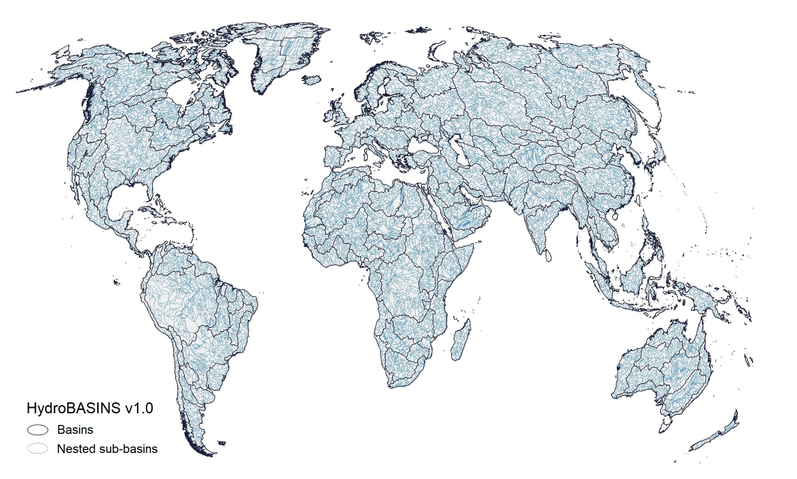
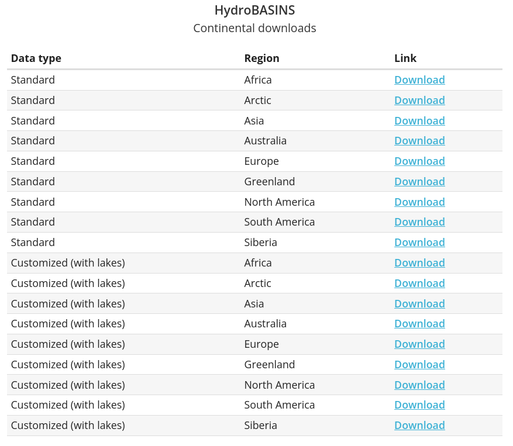

# HYDROATLAS
Página: https://www.hydrosheds.org/products/hydrobasins

### Licencia: 
The HydroBASINS database is freely available for scientific, educational and commercial use. The data are distributed under the same license agreement as the HydroSHEDS core products, which is included in the HydroSHEDS Technical Documentation. For all regulations regarding license grants, copyright, redistribution restrictions, required attributions, disclaimer of warranty, indemnification, liability, and waiver of damages, please refer to the license agreement.
By downloading and using the data the user agrees to the terms and conditions of this license.

### Referencia:
Lehner, B., Grill G. (2013). Global river hydrography and network routing: baseline data and new approaches to study the world’s large river systems. Hydrological Processes, 27(15): 2171–2186. https://doi.org/10.1002/hyp.9740

## Portada
Mapa de la distribución de datos de HydroLakes o HydroBasins

## Descargas 
Opciones para descargar. En mi caso estuve analizando algunos shapes de South America con y sin lagos.

